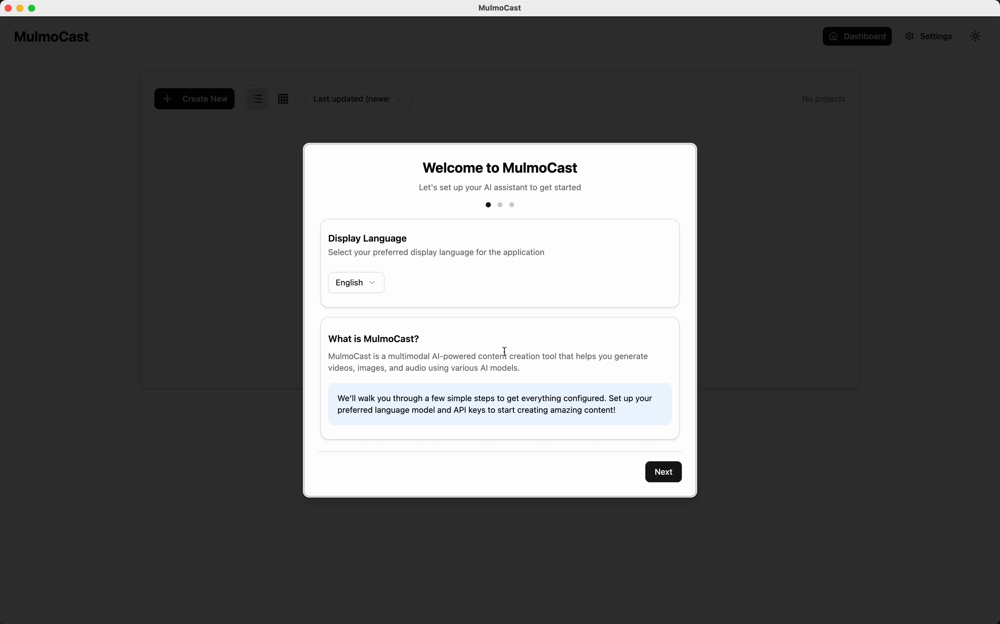
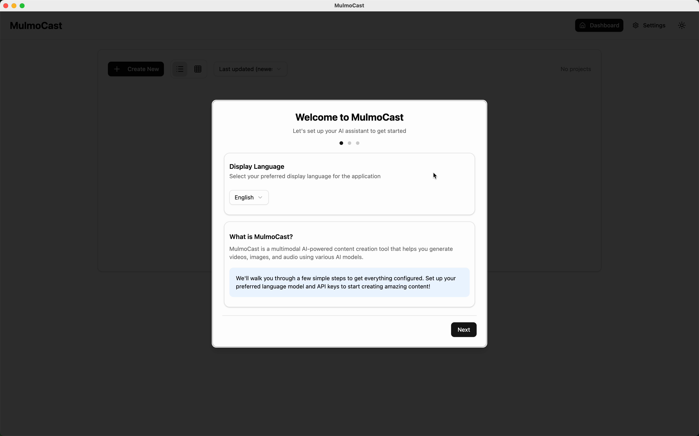
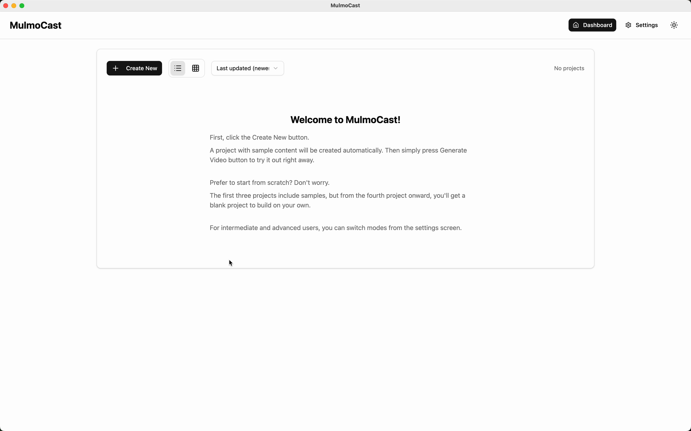
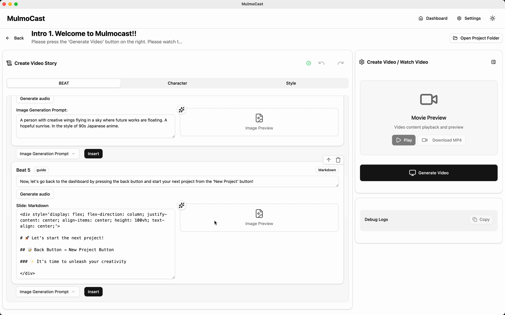
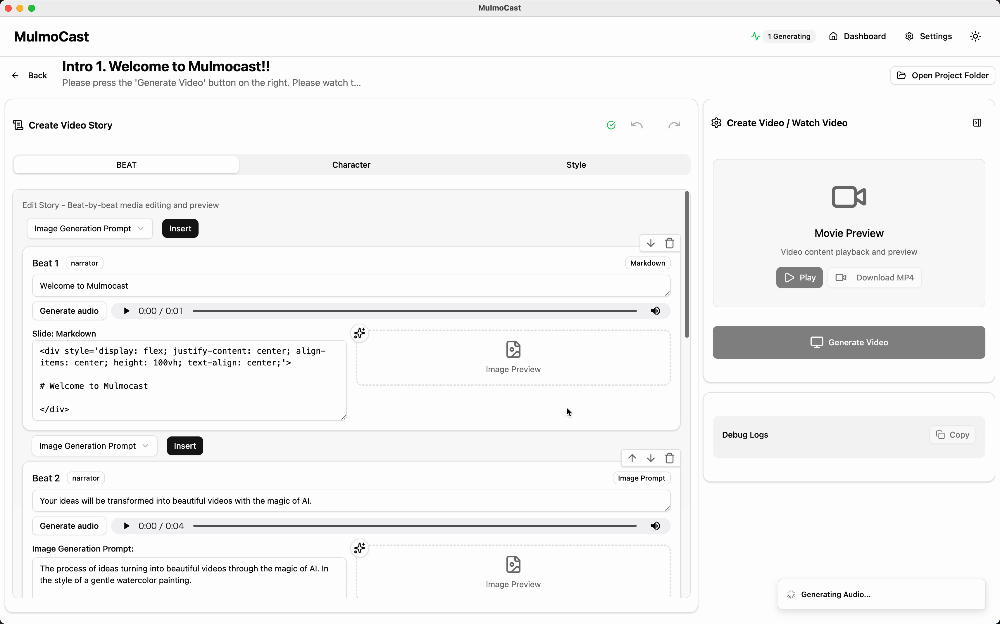
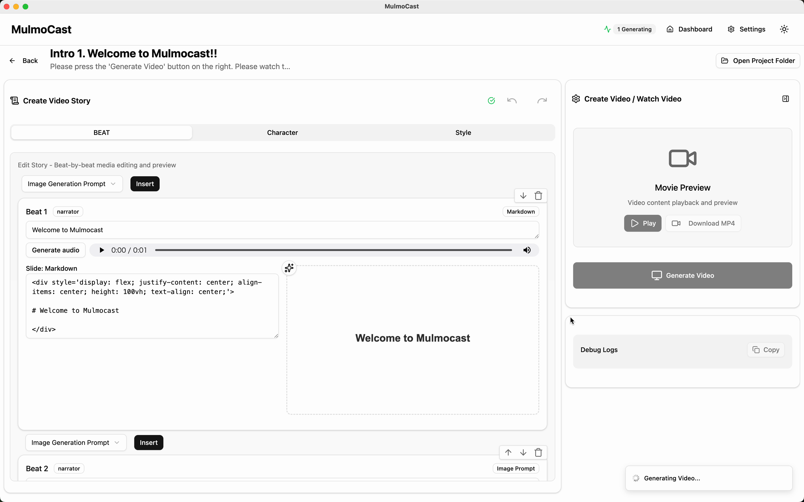
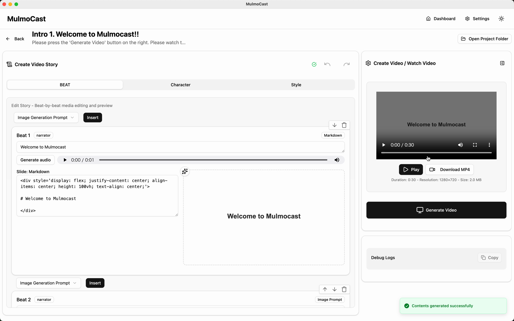
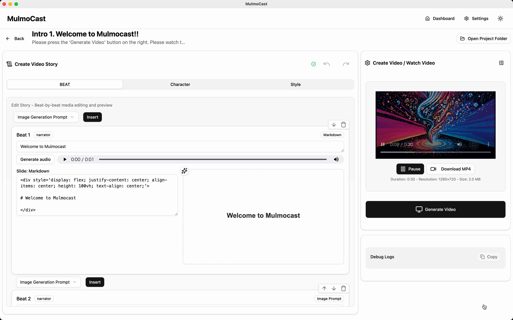
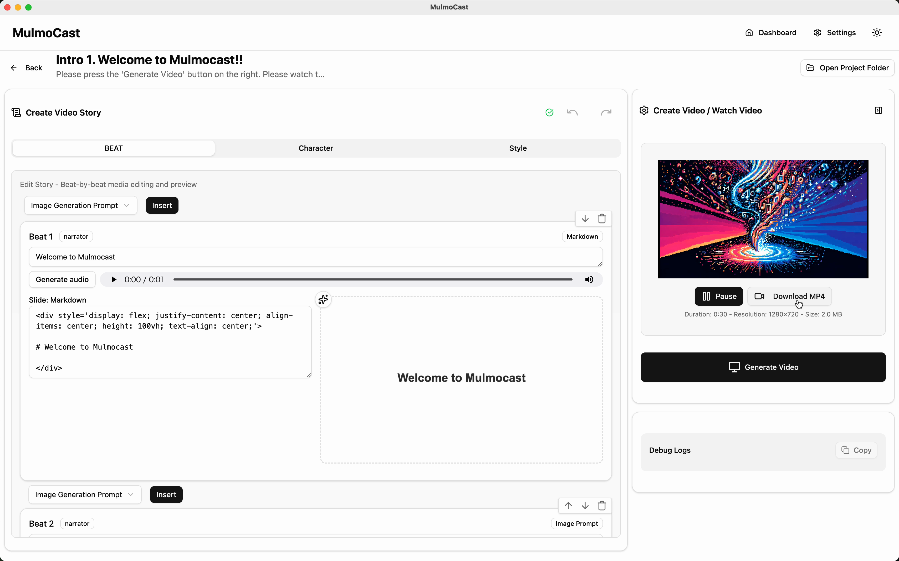

# MulmoCast 初回セットアップ＆動画生成マニュアル

このマニュアルでは、MulmoCastの初回起動時のセットアップから、サンプルプロジェクトを利用して最初の動画を生成・保存するまでの一連の手順を、操作動画に基づいて詳細に解説します。

## 1. 初回セットアップ（オンボーディング）

アプリケーションを初めて起動した際に表示されるセットアップウィザードの設定手順です。

1.  **[00:00] ウェルカム画面と表示言語の選択**

    

    *   「Welcome to MulmoCast」というタイトルのポップアップが表示されます。
    *   `Display Language` という項目で、アプリケーションの表示言語を選択します。動画では `English` が選択されています。
    *   内容を確認後、右下の `[Next]` ボタンをクリックします。

2.  **[00:12] APIキーの設定**

    

    *   「API Key Settings」画面に切り替わります。
    *   `OpenAI API Key` の入力フィールドに、あらかじめ取得しておいたご自身のOpenAI APIキーを入力（またはペースト）します。
    *   入力後、右下の `[Next]` ボタンをクリックします。
    *   #### **ユーザーがつまずきやすいポイント**
        *   この操作には、事前にOpenAIのウェブサイトでAPIキーを取得しておく必要があります。APIキーがないと先に進めませんのでご注意ください。

3.  **[00:16] セットアップの完了**

    

    *   緑色のチェックマークと共に「Setup Complete!」と表示されれば、初期設定は完了です。
    *   `What's next?` の項目で、このアプリケーションでできることの概要（スクリプト作成、画像・動画・音声の自動生成など）が確認できます。
    *   右下の `[Complete Setup]` ボタンをクリックして、ダッシュボード画面に進みます。

## 2. サンプルプロジェクトによる動画生成

ダッシュボード画面から、あらかじめ用意されているサンプルプロジェクトを使って動画を生成し、保存する手順です。

1.  **[00:23] 新規プロジェクトの作成**

    

    *   「Welcome to MulmoCast!」と表示されたダッシュボード画面が表示されます。
    *   画面左上にある黒い `[+ Create New]` ボタンをクリックします。
    *   #### **重要な操作場面の詳細**
        *   初回〜3回目のプロジェクト作成時は、操作に慣れるためのサンプルコンテンツ（台本や画像生成の指示文）が自動的に読み込まれた状態でプロジェクトが開始されます。

2.  **[00:24] プロジェクト編集画面の確認**

    

    *   「Intro 1. Welcome to MulmoCast!!」というタイトルのプロジェクト編集画面が開きます。
    *   **画面構成のポイント:**
        *   **中央エリア (`Create Video Story`)**: 動画の各シーン（`Beat 1`, `Beat 2`...）のセリフや画像生成プロンプトが設定されています。ここを編集することでオリジナルの動画を作成します。
        *   **右側エリア (`Create Video / Watch Video`)**: 動画の生成ボタンやプレビューが表示されるエリアです。

3.  **[00:30] 動画の生成開始**

    

    *   画面右側の `Create Video / Watch Video` パネル内にある、黒い `[Generate Video]` ボタンをクリックします。
    *   クリック後、ボタンの表示が「1 Generating」に変わり、動画生成プロセスが開始されます。右下のデバッグログエリアにも「Generating Audio, Audio...」「Generating Image, Image...」といった進行状況が表示されます。

4.  **[00:36] 生成プロセスの詳細**

    

    *   アプリケーションが各 `Beat` に設定された内容に基づいて、自動で処理を進めます。
        *   **音声生成 (`Generate audio`)**: 設定されたセリフからナレーション音声を生成します。
        *   **画像生成 (`Image Generation Prompt`)**: 設定されたプロンプトを基にAIが画像を生成します。
    *   生成が完了した `Beat` から順に、`Image Preview` 欄に画像が表示されていきます。
    *   #### **ユーザーがつまずきやすいポイント**
        *   動画の長さやシーン数によって、生成には数分かかる場合があります。処理が完了するまで、画面を閉じたり他の操作をしたりせずにお待ちください。

5.  **[01:08] 生成完了と動画プレビュー**

    

    *   画面右下に緑色の「Contents generated successfully」という通知が表示されたら、動画の生成は完了です。
    *   `Create Video / Watch Video` パネルに、完成した動画のプレビューが表示されます。
    *   パネル内の `[▶ Play]` ボタンをクリックすると、その場で動画を再生して内容を確認できます。 **[01:12]**

    

6.  **[01:23] 動画ファイルのダウンロード**

    

    *   #### **重要な操作場面の詳細**
        *   プレビュー画面の下にある `[Download MP4]` ボタンをクリックします。
        *   お使いのPCのファイル保存ダイアログが開きます。**[01:25]**

        
        *   ファイル名を確認し、保存したい場所を選択して `[保存]` ボタンをクリックすると、動画ファイル（.mp4形式）がPCにダウンロードされます。

以上で、MulmoCastを使った基本的な動画作成の一連の操作は完了です。