# MulmoCast: Advanced Video Creation Manual

This guide details the process of creating a video from a blank project, including applying style templates, setting up characters, generating individual assets, enabling advanced features like Lip Sync, and troubleshooting common errors.

## 1. Project Initialization

1.  **[00:01] Create a New Blank Project**

    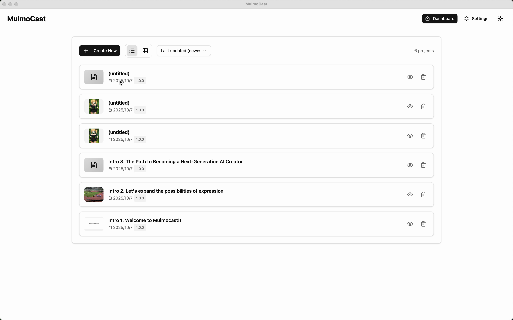

    *   From the main `Dashboard`, click the `[+ Create New]` button in the top-left corner.
    *   Since this is the fourth project or later, it will open as a blank, "untitled" project, unlike the initial tutorial projects.

## 2. Applying a Style Template

Style templates quickly populate settings for voice, image style, and transitions to ensure a consistent look and feel.

1.  **[00:08] Navigate to the Style Tab**

    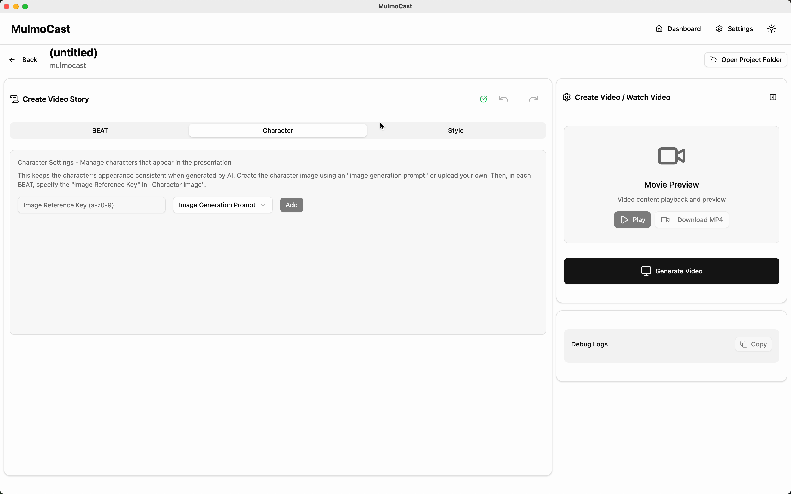

    *   In the "Create Video Story" panel, click the `Style` tab.

2.  **[00:10] Apply a Pre-defined Style**

    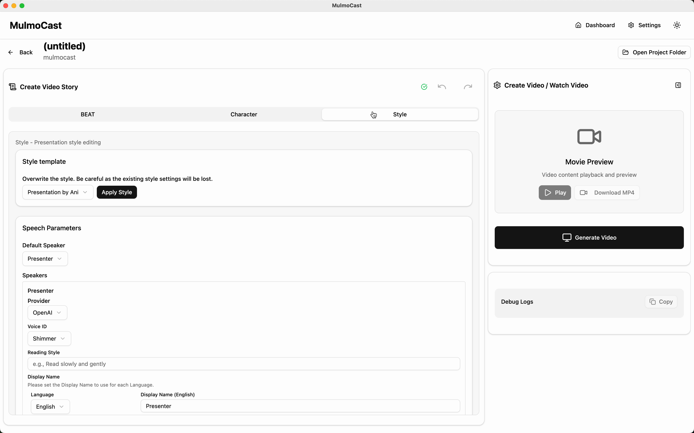

    *   Under the `Style template` section, select a template from the dropdown menu. In the video, "Presentation by Ani" is chosen.
    *   Click the `[Apply Style]` button.
    *   #### **Key Action Details**
        *   Applying a style automatically populates multiple settings below, including `Speech Parameters`, `Image Parameters`, and `Audio Parameters`. You can see the fields fill with information related to the "Ani" character style.

## 3. Setting Up a Consistent Character

To maintain the same character appearance across different scenes, you must first define it in the `Character` tab.

1.  **[00:22] Navigate to the Character Tab**

    

    *   Click the `Character` tab.

2.  **[00:23] Add a New Character**

    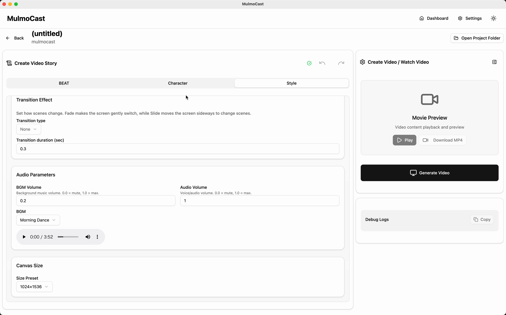

    *   **Image-Reference Key**: Enter a short, memorable key for your character (e.g., `ani`). This key will be used later to assign this character to a specific scene.
    *   **Image Generation Prompt**: Provide a direct URL to a reference image of your character. This image will be used by the AI to maintain visual consistency.
    *   Click the `[Add]` button. The reference image will appear in the preview box.

## 4. Building the Video Scene by Scene (Beat Editing)

Now, you will populate the individual scenes (Beats) with content.

1.  **[00:27] Return to the Beat Tab**

    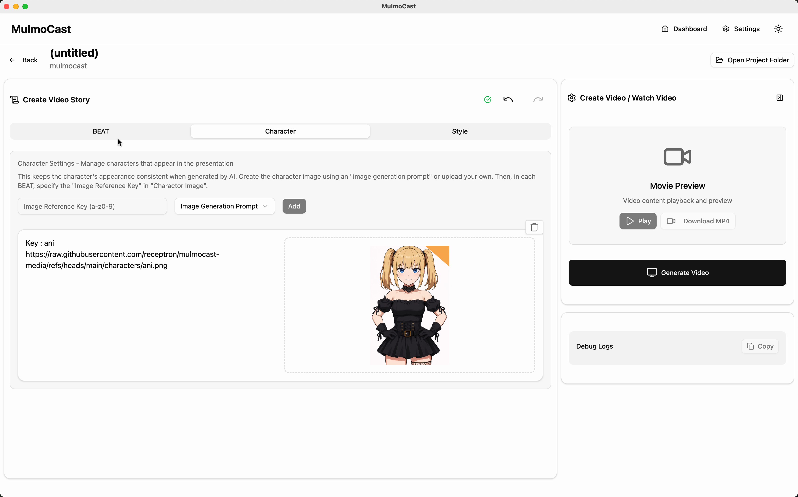

    *   Click the `BEAT` tab to go back to the main story editor.

2.  **[00:33] Populate Beat 1**

    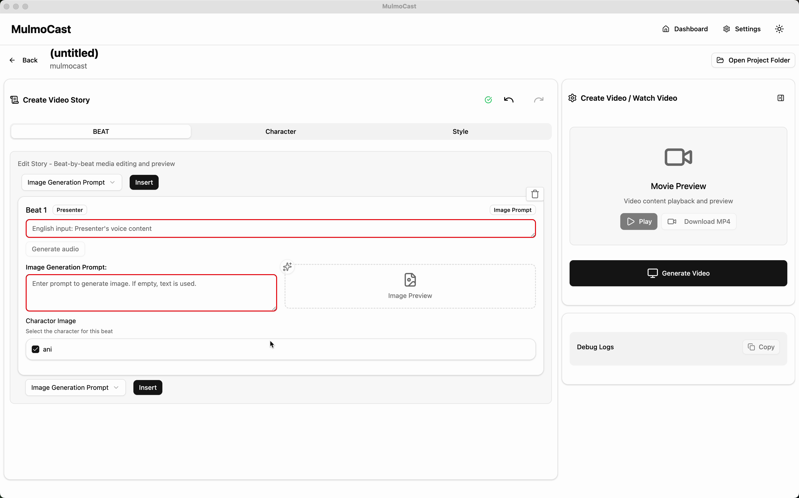

    *   **Script**: In the large text box for `Beat 1`, type or paste the narration script. (e.g., "Hey there! What's up? I'm just chilling...").
    *   **Image Prompt**: In the `Image Generation Prompt` box, describe the visual you want for this scene. (e.g., "in the beautiful forest").
    *   **Assign Character**: Below the prompt, check the box next to the character key you created (`ani`) to link this scene to your character.

3.  **[00:47] Generate a Single Image (Optional)**

    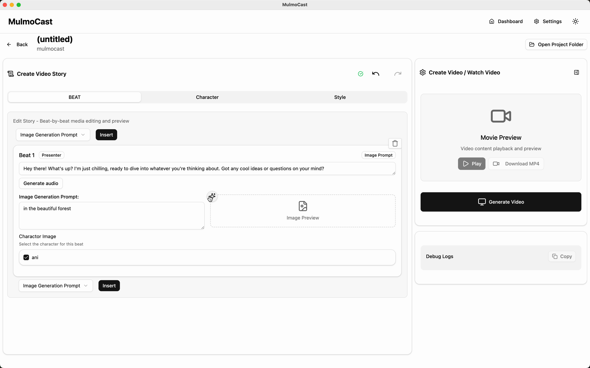

    *   To preview an image before generating the entire video, click the **magic wand icon** (`Generate Image`) located to the right of the `Image Generation Prompt` box.
    *   The `Image Preview` area will show "Generating..." and then display the result. **[01:29]**

    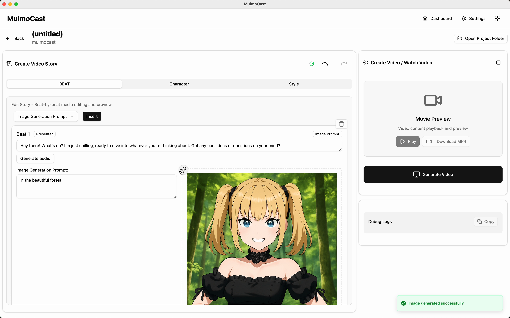

## 5. Configuring Advanced Features (Lip Sync)

Lip sync requires an additional API key.

1.  **[01:40] Open Settings**

    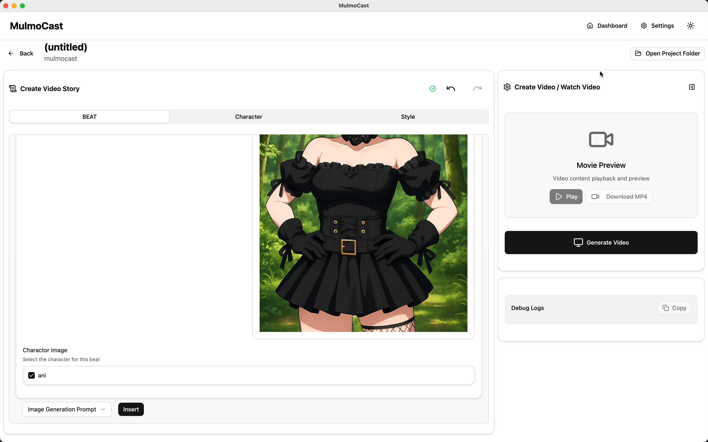

    *   Click the `Settings` icon (gear symbol) in the top-right corner of the application.

2.  **[01:43] Add Replicate API Token**

    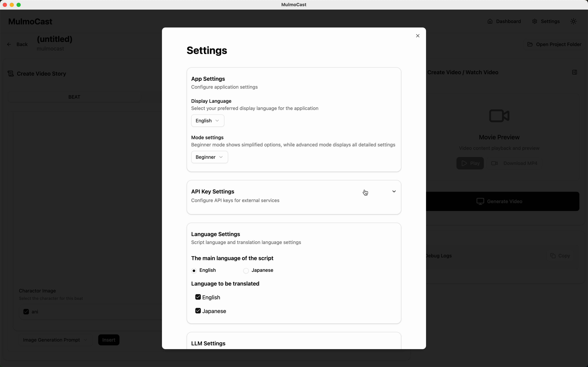

    *   In the Settings pop-up, click to expand the `API Key Settings` section.
    *   Locate the `Replicate API Token` field and enter your key.
    *   Close the settings window. A "Settings saved" notification will briefly appear.
    *   #### **Potential User Pain Point**
        *   Lip sync functionality will fail without a valid Replicate API Token. This is a separate service from OpenAI, and you must acquire a key from their website.

## 6. Populating Additional Beats with Advanced Features

1.  **[02:06] Add Content to Beat 2**

    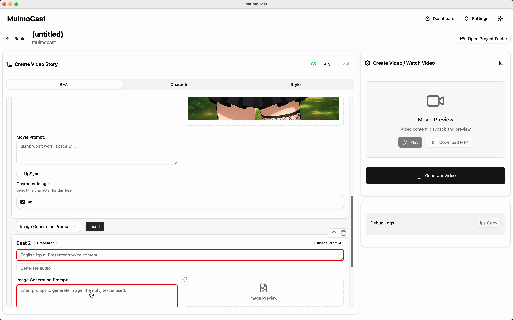

    *   Scroll down to `Beat 2`.
    *   Enter the script for the second scene. **[02:13]**

    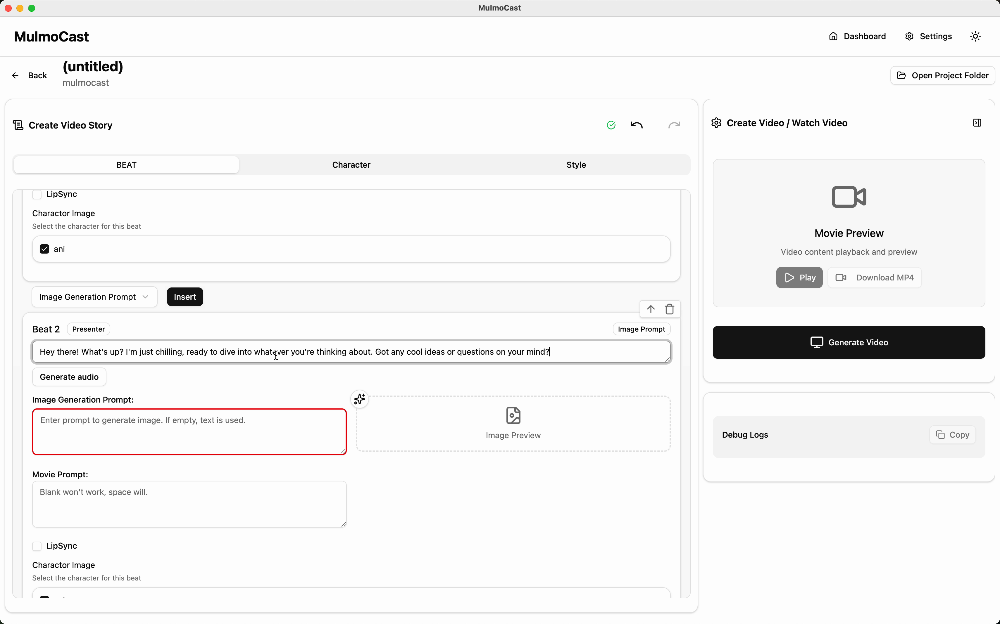

    *   Enter the `Image Generation Prompt` for the second scene. **[02:42]** (e.g., "wear sun glasses, beach side, sitting on chair").

    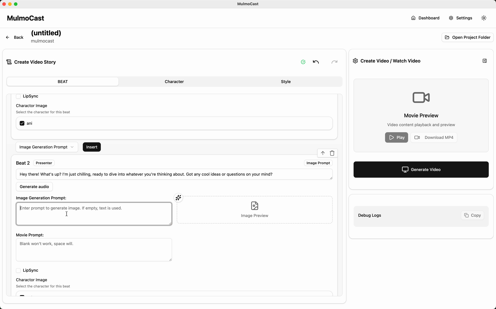

2.  **[02:47] Enable Lip Sync**

    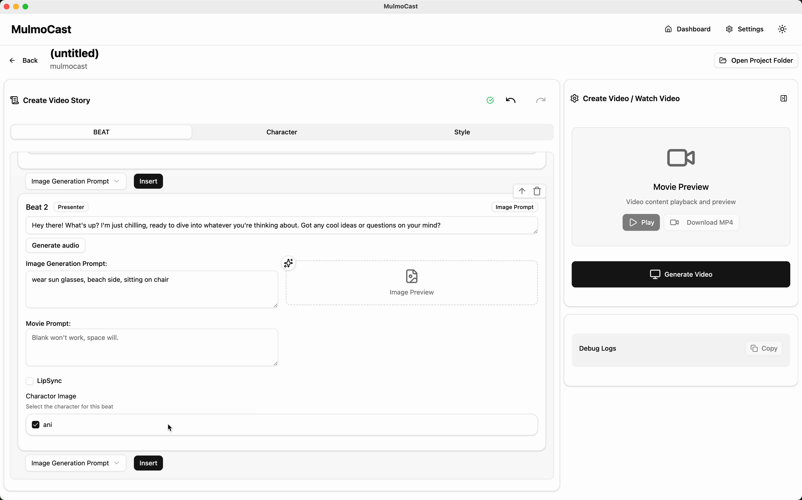

    *   For `Beat 2`, check the box labeled `LipSync`. This instructs the application to generate a video clip with animated mouth movements that match the audio for this specific beat.
    *   #### **Key Action Details**
        *   When `LipSync` is enabled, the `Image Generation` for that beat produces a static image first, and the lip-sync video is generated during the final `Generate Video` step.

## 7. Final Video Generation and Troubleshooting

1.  **[02:52] Generate the Full Video**

    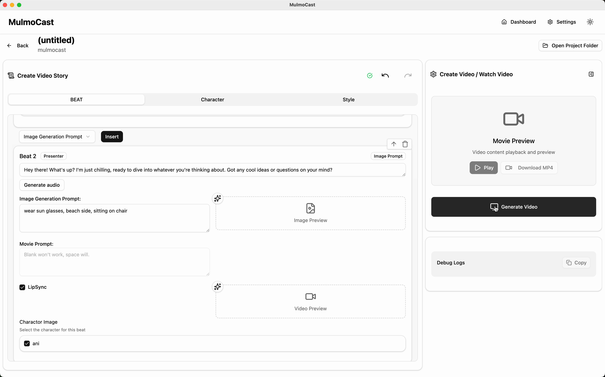

    *   Click the main `[Generate Video]` button on the right-hand panel. The process of generating audio, images, and lip-sync video will begin.

2.  **[04:44] Handle Generation Errors**

    

    *   **Potential User Pain Point**: If an API key is missing or incorrect, an error will occur. In the video, two red error messages appear at the bottom right: "Failed to generate contents" and "An error occurred with lip sync [Replicate]." This indicates the Replicate API key was not entered correctly before starting the generation.

3.  **[04:47] Correct and Re-Generate**

    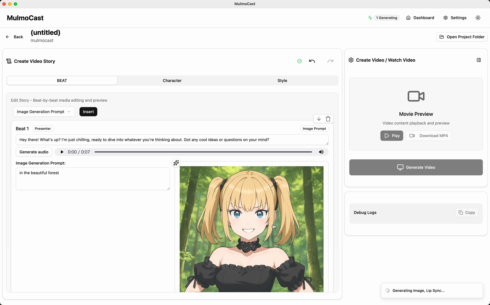

    *   To fix this, the user re-clicks `[Generate Video]`. The system re-uses the already generated assets and only re-attempts the failed processes.
    *   The final video is successfully generated and appears in the preview window. **[08:14]**

    

## 8. Preview and Download

1.  **[08:21] Play and Verify the Final Video**

    

    *   Click the `[▶ Play]` button in the preview player to watch the final video. You will see the static image for Beat 1 and the lip-synced video clip for Beat 2.

2.  **[08:39] Download the Video**

    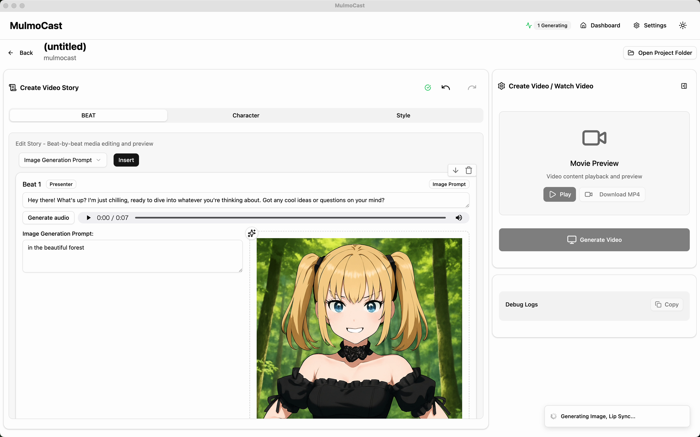

    *   Click the `[Download MP4]` button.
    *   A file-saving dialog will appear. Choose a location on your computer and click `[Save]` to download your completed video file. **[08:43]**

    