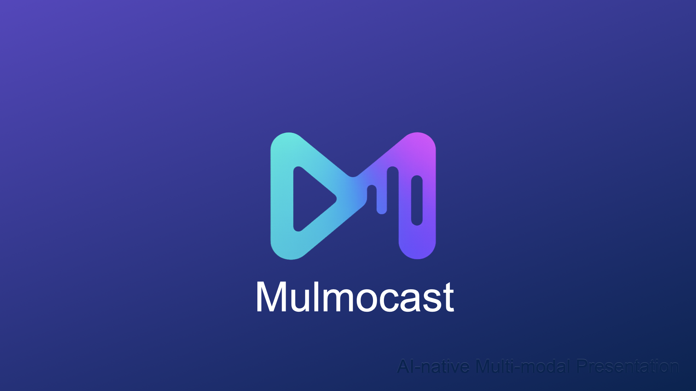

# MulmoCast v1.0.5 リリースノート

MulmoCast v1.0.5の新機能と改善点を紹介するリリースノート動画

# 🎉 MulmoCast v1.0.5 Released!
# 🎉 MulmoCast v1.0.5 リリース！

## November 15, 2025
## 2025年11月15日

マルモキャスト バージョン1.0.5をリリースしました！このバージョンでは、5つの主な更新があります。

### 1. Click-to-Open File Selection Dialog for Loading Files   1. クリックで開くファイル選択画面でファイルを読み込み

1つ目。ファイルの読み込みに、クリックで開く「ファイル選択画面」も使えるようになりました。従来のドラッグアンドドロップ方式も引き続き利用可能です。

### BEAT tab > Image or Movie file   BEAT タブ > 画像または動画ファイル

BEATタブの画像または動画ファイルを読み込む際に使用できます。

### Materials > image file   素材 > 画像ファイル

また、素材タブの画像ファイルを読み込む際にも使用できます。

### 2. Reuse Generated Images and Videos Across BEATs   2. プロジェクト内の生成済み画像・動画を他のBEATで再利用可能

2つ目。プロジェクト内で生成した画像・動画を、他のビートで再利用できるようになりました。ファイル選択画面から、プロジェクト内で既に生成された素材を選択できます。

### BEAT tab > Image or Movie file   BEAT タブ > 画像または動画ファイル

こちらも、BEATタブの画像または動画ファイルを読み込む際に使用できます。

### Materials > image file   素材 > 画像ファイル

また、素材タブの画像ファイルを読み込む際にも使用できます。

### 3. Specify BEAT Duration in Image Generation Prompt (Advanced Mode)   3. 画像生成プロンプトでBEAT時間を指定可能（上級モード）

3つ目。上級モードの「画像生成プロンプト」で、各ビートの時間を指定できるようになりました。

### 3. Specify BEAT Duration in Image Generation Prompt (Advanced Mode)   3. 画像生成プロンプトでBEAT時間を指定可能（上級モード）

動画生成の有無で設定可能な時間が異なります。

### 4. Character Tab Renamed to Materials Tab   4. 「キャラ」タブを「素材」タブへ名称変更

4つ目。「キャラ」タブの名称を「素材」タブへ変更しました。

### 5. Preset Templates Added for Mermaid Diagrams   5. Mermaid図表用のプリセットテンプレートを追加

5つ目。マーメイドにプリセットテンプレートを追加しました。

# Thank You!
# ありがとうございました！

## MulmoCast v1.0.5

### Happy Creating! / 楽しい創作を！

マルモキャスト バージョン1.0.5をお楽しみください！

